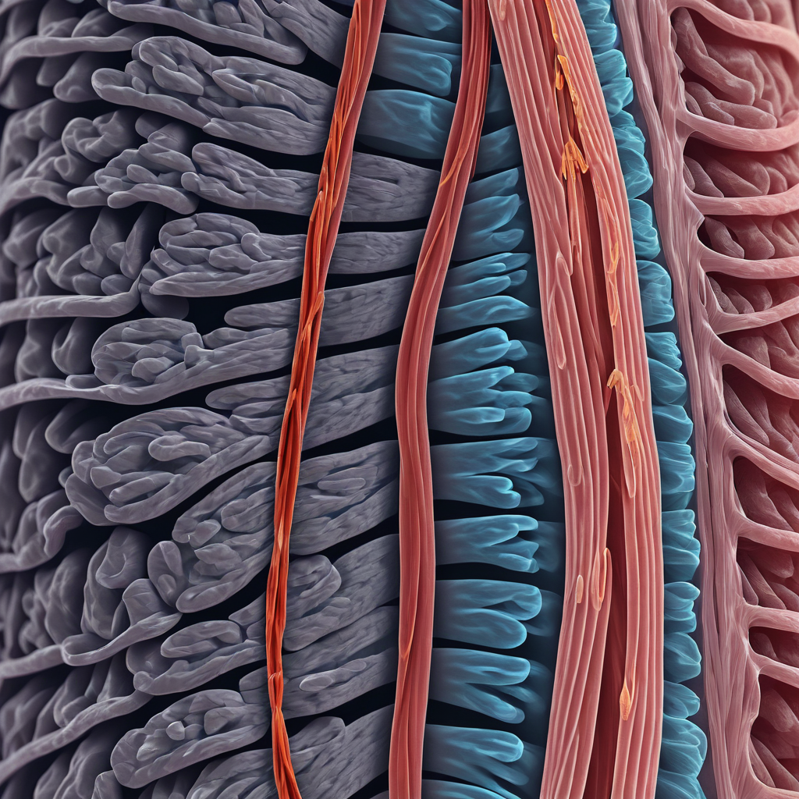
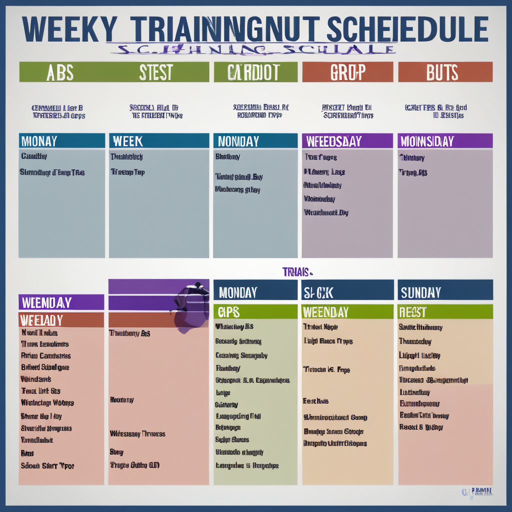
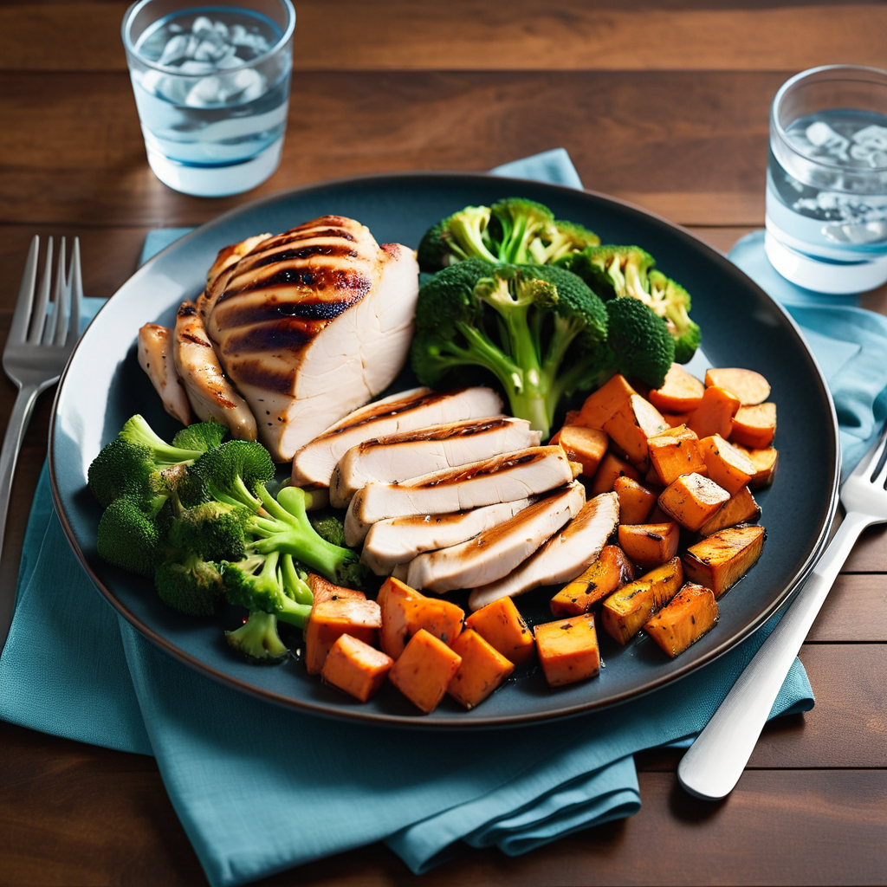
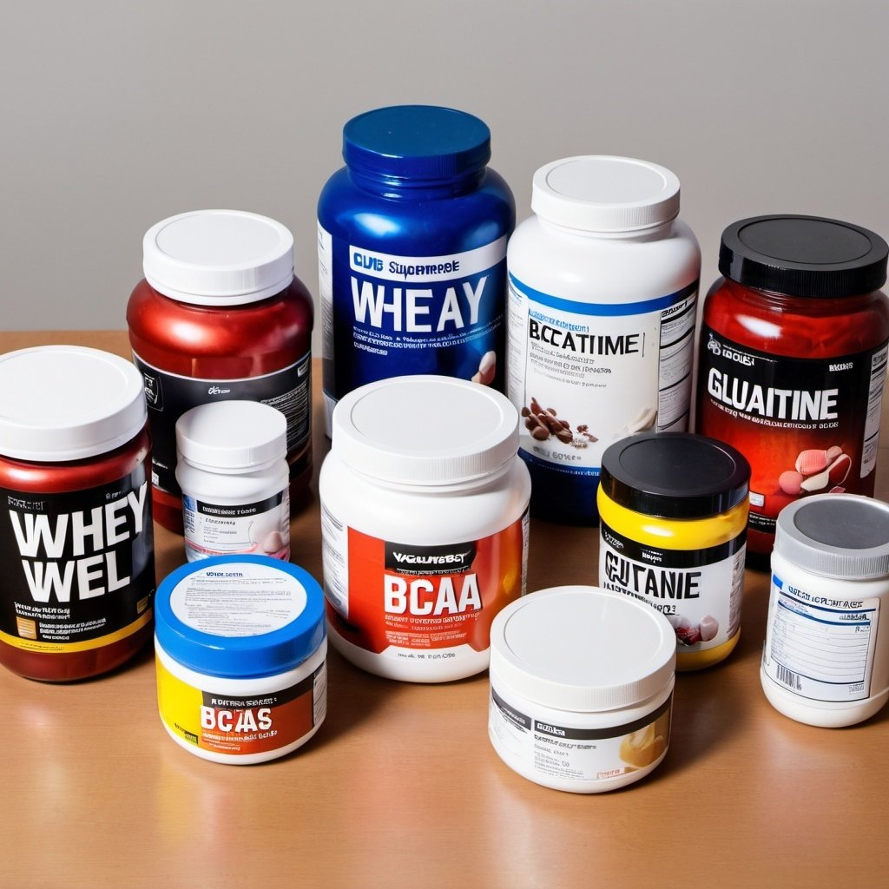

# Guia Completo para Hipertrofia e Nutrição

## Introdução

Bem-vindo ao "Guia Completo para Hipertrofia e Nutrição". Este e-book é destinado a pessoas que treinam na academia de 5-6 vezes por semana e desejam aumentar a massa muscular de forma saudável. Vamos explorar os princípios da hipertrofia, a importância da nutrição e suplementação, e como montar um plano de treino eficiente.

---

## Capítulo 1: Entendendo a Hipertrofia

Hipertrofia é o aumento do tamanho das células musculares, resultando em músculos maiores e mais fortes. Para alcançar a hipertrofia, é essencial entender os princípios básicos do treino e da nutrição. Existem dois tipos principais de hipertrofia:

- **Hipertrofia sarcoplasmática:** Envolve o aumento do volume do sarcoplasma (fluido dentro da célula muscular). Este tipo de hipertrofia é geralmente alcançado através de treinos com repetições mais altas e menos peso. Resulta em músculos visualmente maiores, mas com menor densidade.
- **Hipertrofia miofibrilar:** Refere-se ao aumento do tamanho das miofibrilas (componentes contráteis do músculo). Este tipo de hipertrofia é geralmente alcançado através de treinos com repetições mais baixas e mais peso. Resulta em músculos mais densos e fortes.

{ width=50% }

A **sobrecarga progressiva** é o princípio fundamental para a hipertrofia, que envolve aumentar gradualmente a carga de trabalho nos músculos ao longo do tempo. Isso pode ser feito através do aumento do peso, do número de repetições, ou da intensidade do exercício.

---

## Capítulo 2: Planejamento de Treino

Um bom plano de treino é a espinha dorsal de qualquer programa de hipertrofia. Aqui, discutiremos a estrutura de um plano de treino eficaz:

- **Frequência de treino:** Treinar cada grupo muscular de 2 a 3 vezes por semana é ideal para a hipertrofia. Isso pode ser distribuído em treinos de corpo inteiro, ou em divisões específicas.

{ width=50% }

- **Divisão de grupos musculares:** Dividir os treinos em diferentes grupos musculares permite um foco mais intenso e recuperação adequada. Exemplos incluem:
  - **Push/Pull/Legs:** Divisão em que os treinos são separados em empurrar (peito, ombros, tríceps), puxar (costas, bíceps), e pernas.
  - **Upper/Lower:** Divisão entre parte superior do corpo e parte inferior do corpo.
  - **Divisão por dias:** Exemplo: segunda-feira (peito e tríceps), terça-feira (costas e bíceps), quarta-feira (pernas), etc.
- **Número de séries e repetições:** Para a hipertrofia, geralmente são recomendadas 3-5 séries de 8-12 repetições por exercício. Isso proporciona um equilíbrio entre volume e intensidade.
- **Tipos de exercícios:** 
  - **Exercícios compostos:** Movimentos que envolvem múltiplas articulações e grupos musculares, como agachamentos, supinos, e levantamentos terra. Esses exercícios são fundamentais para o crescimento muscular.
  - **Exercícios isolados:** Movimentos que focam em um único grupo muscular, como flexões de bíceps e extensões de tríceps. São importantes para o trabalho detalhado e balanceamento dos músculos.
- **Descanso e recuperação:** O descanso adequado entre as séries (1-2 minutos) e noites de sono de qualidade são essenciais para o crescimento muscular. Além disso, ter dias de descanso ou treinos leves ajuda na recuperação muscular.

---

## Capítulo 3: Nutrição para Hipertrofia

A nutrição desempenha um papel crucial no crescimento muscular. Este capítulo cobrirá os principais aspectos da dieta para hipertrofia:

- **Macronutrientes:**
  - **Proteínas:** Essenciais para a reparação e crescimento muscular. Recomenda-se consumir 2.0-2.2g de proteína por kg de peso corporal. Fontes incluem carnes magras, peixes, ovos, laticínios, leguminosas e suplementos de proteína.
  - **Carboidratos:** Fornecem energia para os treinos e ajudam na recuperação. De 4-6g de carboidratos por kg de peso corporal são recomendados. Fontes incluem arroz, batata, aveia, massas integrais e frutas.
  - **Gorduras:** Importantes para a produção hormonal e saúde geral. De 0.8-1g de gordura por kg de peso corporal é ideal. Fontes incluem abacate, nozes, sementes, azeite de oliva e peixes gordurosos.
- **Micronutrientes:** Vitaminas e minerais são essenciais para várias funções corporais, incluindo a recuperação muscular e a prevenção de lesões. Uma dieta rica em vegetais, frutas, grãos integrais e proteínas magras geralmente cobre essas necessidades.
- **Planejamento de refeições:** Comer refeições balanceadas ao longo do dia é fundamental. Um exemplo de planejamento pode incluir:
  - **Café da manhã:** Ovos mexidos com espinafre, pão integral e suco de laranja.
  - **Lanche da manhã:** Iogurte grego com frutas vermelhas.
  - **Almoço:** Peito de frango grelhado, batata-doce e salada de brócolis.
  - **Lanche da tarde:** Shake de proteína com banana.
  - **Jantar:** Salmão grelhado, quinoa e aspargos.
  - **Ceia:** Queijo cottage com amêndoas.
- **Suplementação:** Suplementos como whey protein, creatina e BCAAs podem ajudar a atingir as metas nutricionais e melhorar o desempenho. É importante escolher suplementos de qualidade e seguir as dosagens recomendadas.
- **Exemplos de planos alimentares:** Forneceremos exemplos de planos alimentares para diferentes necessidades calóricas (2000, 2500, 3000 calorias) para atender diversas metas e preferências dietéticas.

{ width=50% }

---

## Capítulo 4: Suplementos e Ergogênicos

Suplementos podem ajudar a preencher lacunas nutricionais e melhorar o desempenho. Neste capítulo, discutiremos os suplementos mais populares para hipertrofia:

{ width=50% }

- **Whey Protein:** Excelente fonte de proteínas de alta qualidade que ajuda na recuperação e crescimento muscular. É rapidamente absorvido pelo corpo, tornando-o ideal para o pós-treino.
- **Creatina:** Melhora a força e a performance nos treinos de alta intensidade, promovendo o crescimento muscular. A creatina monohidratada é a forma mais estudada e eficaz.
- **BCAAs (Aminoácidos de Cadeia Ramificada):** Ajudam na recuperação muscular e reduzem a fadiga durante os treinos. São particularmente úteis durante períodos de treino intenso ou restrição calórica.
- **Glutamina:** Ajuda na recuperação e no suporte ao sistema imunológico, especialmente em períodos de treino intenso.
- **Pré-treinos:** Aumentam a energia e o foco durante os treinos, permitindo um melhor desempenho. Geralmente contêm ingredientes como cafeína, beta-alanina e citrulina malato.

---

## Capítulo 5: Ajustando seu Plano

Cada pessoa é única e pode precisar de ajustes em seu plano de treino e nutrição. Este capítulo abordará:

- **Monitorar seu progresso:** Medir seu progresso regularmente (peso corporal, circunferência dos músculos, força nos exercícios) para ajustar seu plano conforme necessário. Manter um diário de treino e nutrição pode ajudar a identificar o que funciona melhor para você.

{ width=50% }

- **Ajustar a carga de treino:** Aumentar gradualmente o peso levantado ou o número de repetições para continuar progredindo. Técnicas como periodização (variação planejada no volume e intensidade) podem ser úteis.
- **Modificações na dieta:** Ajustar a ingestão calórica e macronutrientes conforme necessário para continuar progredindo em direção aos seus objetivos. Pode ser necessário aumentar a ingestão de calorias durante períodos de bulking (ganho de massa) ou reduzi-la durante períodos de cutting (perda de gordura).
- **Considerar feedback do corpo:** Prestar atenção aos sinais do corpo, como fadiga, dor ou estagnação, e ajustar seu plano para evitar lesões e burnout.

---

## Capítulo 6: Dicas e Truques para Maximizar Resultados

Pequenos ajustes podem fazer uma grande diferença em seus resultados. Aqui estão algumas dicas adicionais:

- **Técnicas avançadas de treino:** Métodos como drop sets, supersets, e técnicas de intensidade podem ajudar a superar platôs. Explicaremos como cada técnica funciona e quando usá-las.
- **Importância do sono:** Dormir pelo menos 7-9 horas por noite é crucial para a recuperação e crescimento muscular. Dicas para melhorar a qualidade do sono incluem manter um horário regular de sono, evitar eletrônicos antes de dormir, e criar um ambiente de sono confortável.

{ width=50% }

- **Gerenciamento de estresse:** Práticas como meditação, yoga, e hobbies podem ajudar a reduzir o estresse, que pode afetar negativamente a recuperação e o crescimento muscular. Manter um equilíbrio entre treino, trabalho e vida pessoal é fundamental.
- **Manter a motivação:** Estabelecer metas realistas, acompanhar seu progresso e celebrar pequenas vitórias podem ajudar a manter a motivação alta. Encontrar um parceiro de treino ou participar de uma comunidade fitness pode oferecer suporte adicional.

---

## Conclusão

Parabéns por concluir o "Guia Completo para Hipertrofia e Nutrição"! Com dedicação e consistência, você estará no caminho certo para alcançar seus objetivos de crescimento muscular. Lembre-se de que a jornada é tão importante quanto o destino. Continue se esforçando e celebrando cada conquista ao longo do caminho.

{ width=50% }

---

